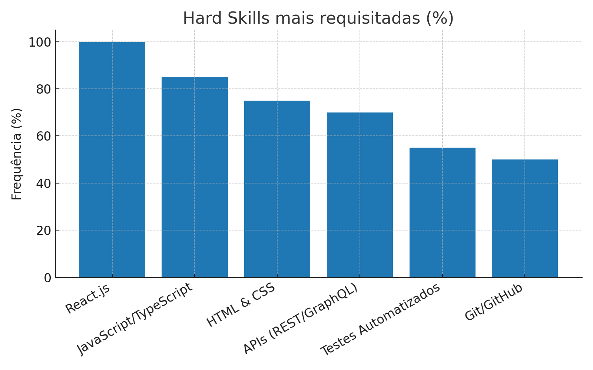
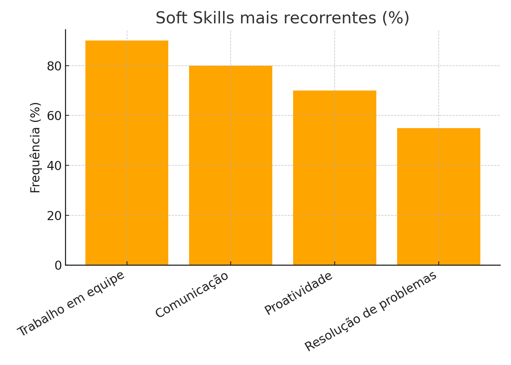
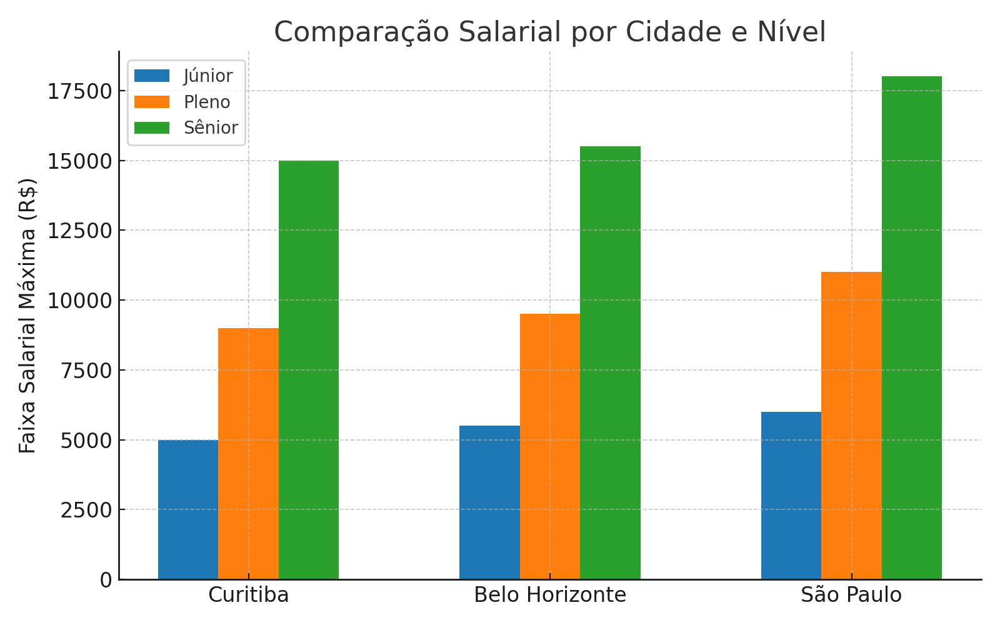

# 📊 Pesquisa de Vagas - Desenvolvimento Front-End

## 📌 Introdução
O setor de **Tecnologia da Informação (TI)** é um dos que mais cresce no Brasil e no mundo, e dentro dele, o papel do **Desenvolvedor Front-End** se destaca como essencial para a criação de interfaces modernas, responsivas e interativas.  

Com o avanço das aplicações web e móveis, a demanda por profissionais com domínio em **React, JavaScript, TypeScript e testes automatizados** está cada vez maior. Além disso, o mercado valoriza também **soft skills** como comunicação, trabalho em equipe e proatividade, que garantem um bom desempenho em ambientes colaborativos.  

Este relatório apresenta uma análise de vagas para **Desenvolvedor Front-End**, considerando três grandes polos de tecnologia no Brasil: **Curitiba (PR), Belo Horizonte (MG) e São Paulo (SP)**.  

A pesquisa foi realizada em plataformas como **LinkedIn, Glassdoor e Programathor**, avaliando oportunidades nos níveis **Júnior, Pleno e Sênior**.

---

## 🔎 Vagas Analisadas
- Total de vagas: **12**  
- Localização: **Curitiba (4), Belo Horizonte (4), São Paulo (4)**  
- Níveis: **Júnior (4), Pleno (5), Sênior (3)**  

---

## 🛠️ Hard Skills mais requisitadas

| Skill                | Frequência |
|-----------------------|------------|
| React.js              | ██████████ 100% |
| JavaScript/TypeScript | ████████░░ 85% |
| HTML & CSS            | ███████░░░ 75% |
| Consumo de APIs (REST/GraphQL) | ███████░░░ 70% |
| Testes Automatizados  | █████░░░░░ 55% |
| Git/GitHub            | █████░░░░░ 50% |

### 📊 Gráfico - Hard Skills

  

---

## 🤝 Soft Skills mais recorrentes

| Soft Skill        | Frequência |
|-------------------|------------|
| Trabalho em equipe| █████████░ 90% |
| Comunicação       | ████████░░ 80% |
| Proatividade      | ███████░░░ 70% |
| Resolução de problemas | █████░░░░░ 55% |

### 📊 Gráfico - Soft Skills

  

---

## 💰 Faixa Salarial

| Cidade        | Júnior (R$)     | Pleno (R$)      | Sênior (R$)     |
|---------------|-----------------|-----------------|-----------------|
| Curitiba      | 3.000 - 5.000   | 6.000 - 9.000   | 12.000 - 15.000 |
| Belo Horizonte| 3.200 - 5.500   | 6.500 - 9.500   | 13.000 - 15.500 |
| São Paulo     | 3.500 - 6.000   | 7.000 - 11.000  | 14.000 - 18.000 |

### 📊 Gráfico - Comparação Salarial

  

---

## 📈 Tendências Observadas
- **React** é unanimidade em todas as vagas analisadas.  
- Forte crescimento na exigência de **TypeScript** e **testes automatizados**.  
- **São Paulo** apresenta salários mais competitivos, em média **15% a 20% maiores**.  
- Soft skills continuam sendo fortemente valorizadas, especialmente **comunicação** e **trabalho em equipe**.  

---

## 📝 Plano de Ação (6 meses)

1. **Aprimorar React + TypeScript**  
2. **Estudar Testes Automatizados (Jest, Cypress, React Testing Library)**  
3. **Fortalecer Comunicação em equipe e colaboração em projetos**  

---

## ✅ Conclusão
A pesquisa evidencia que o mercado para **Desenvolvedores Front-End** continua em forte expansão, com destaque para o uso de **React** como tecnologia central e o crescimento na adoção de **TypeScript e práticas de testes automatizados**.  
Além disso, fica claro que **competências interpessoais** como comunicação e colaboração têm grande peso nos processos seletivos, mostrando que o perfil do profissional procurado vai além do domínio técnico.  

Entre as cidades analisadas, **São Paulo** se apresenta como o polo com melhores oportunidades salariais, enquanto **Curitiba e Belo Horizonte** também oferecem boas condições, especialmente para níveis Pleno e Sênior.  

O caminho para se destacar neste mercado passa por uma combinação de **evolução técnica constante e desenvolvimento de soft skills**, garantindo adaptabilidade e relevância profissional.  

---

## 📚 Referências

- [LinkedIn Vagas](https://www.linkedin.com/jobs/)  
- [Glassdoor](https://www.glassdoor.com.br/)  
- [Programathor](https://programathor.com.br/jobs)  

---

✍️  
Experiência Prática II  
Nome: **Renilson Medeiros de Araújo**  
Curso: Análise e Desenvolvimento de Sistemas (ADS)  
Universidade Cruzeiro do Sul
